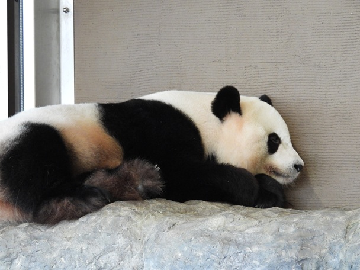

# Llama 3.2 Vision Python Sample

## 準備 
- Ollama のインストール

https://ollama.com/

- ライブラリのインストール

```
pip install ollama
```

## 実行例

```
python3 vision1.py ./sample-image/panda-small.jpg 
```


## STEP1 単純な分析




```
python3 vision1.py ./sample-image/panda-small.jpg
```


結果
```
{'model': 'llama3.2-vision:11b', 'created_at': '2024-11-23T05:55:33.1503728Z', 'message': {'role': 'assistant', 'content': 'この写真には、熊猫のような動物が見えます。でもそれは熊猫ではなく、実際には、パンダです。\n\nパンダとは、食性にあわない草食性の哺乳類で、中国南部に生息する種である。英語では「チンパンジー」の意味の「ギムリー」とも呼ばれている。日本語では、中国名を音訳したものが使われることも多い。「パンダ」は中国語で、チンパンジーのことを言っている言葉とは異なる言葉です。\n\nまた、この画像のパンダは、パンダ科に属する動物であることがわかります。これは、上腕骨に特徴的な「パンダの角」を持ち、その形状から名付けられたことによるものです。'}, 'done_reason': 'stop', 'done': True, 'total_duration': 25556747600, 'load_duration': 23759600, 'prompt_eval_count': 19, 'prompt_eval_duration': 414000000, 'eval_count': 168, 'eval_duration': 25022000000}
```


## STEP2 画像のタグを生成するようプロンプトで指示

```
python3 vision2-tag2-jp.py ./sample-image/panda-small.jpg
```

```
{'model': 'llama3.2-vision:11b', 'created_at': '2024-11-23T06:03:46.9338702Z', 'message': {'role': 'assistant', 'content': '{"tag": ["熊猫", "動物", "草原", "家", "枯れ木"]}'}, 'done_reason': 'stop', 'done': True, 'total_duration': 86103326400, 'load_duration': 2692241000, 'prompt_eval_count': 125, 'prompt_eval_duration': 79784000000, 'eval_count': 25, 'eval_duration': 3514000000}
```


## STEP3 出力を綺麗にする。Pythonの変数の整形とJSONパース

```
python3 vision2-tag3.py ./sample-image/panda-small.jpg
```

``
Response Details:
  Model: llama3.2-vision:11b
  Created At (JST): 2024-11-23 15:13:25
  Total Duration: 86.24s
  Load Duration: 2.67s
  Prompt Eval Count: 127
  Prompt Eval Duration: 80.13s
  Eval Count: 23
  Eval Duration: 3.33s

Parsed Content:
{
  "tag": [
    "熊猫",
    "動物",
    "壁面",
    "石",
    "睡眠"
  ]
}
``

## STEP4 R18判定の追加

```
python3 vision2-tag4.py ./sample-image/ni1.jpeg 
```

```
Response Details:
  Model: llama3.2-vision:11b
  Created At (JST): 2024-11-23 15:16:14
  Total Duration: 86.06s
  Load Duration: 0.03s
  Prompt Eval Count: 168
  Prompt Eval Duration: 80.06s
  Eval Count: 40
  Eval Duration: 5.74s

Parsed Content:

Error: Failed to parse 'content' as JSON.
Raw Content: これは少女を表すと考えられる画像です。

{"tag": ["少女", "剣", "白衣","青い帯","長髪"], "rating": "general" }
```

## STEP5 CSV出力

```
vision2-tag5-csv.py
```

